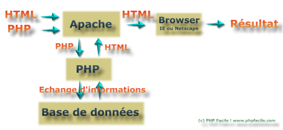
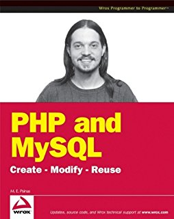

     

<h1><strong>PHP</strong></h1>

<strong><h2>ORIGINE</h2></strong>                                                            
<em><b>PHP : Hypertext Preprocessor fut créé en 1994.</b></em>
  
L'auteur de la première version de ce langage est Rasmus Lerdorf, un programmeur groenlandais et canadien. Il l'a créé pour son site web.  
PHP était à l'origine une bibliothèque logicielle en C (une collection d'entité informatique qui regroupe des données en portion de code) dont il se servait pour conserver une trace des visiteurs qui venaient consulter son CV. Au fur et à mesure qu'il ajoutait de nouvelles fonctionnalités, Rasmus a transformé la bibliothèque en une implémentation capable de communiquer avec des bases de données et de créer des applications dynamiques et simples pour le Web.   
Rasmus décida alors en 1995 de publier son code, pour que tout le monde puisse l'utiliser et en profiter. PHP s'appelait alors PHP/FI (pour Personal Home Page Tools/Form Interpreter).   
En 1997, deux étudiants, Andi Gutmans(programmeur israélien) et Zeev Suraski (développeur israélien), redéveloppèrent le cœur de PHP/FI. Ce travail aboutit un an plus tard à la version 3 de PHP, devenu alors PHP: Hypertext Preprocessor.   
Peu de temps après en 1999, Andi Gutmans et Zeev Suraski commencèrent la réécriture du moteur interne de PHP. Ce fut ce nouveau moteur de script Open Source, appelé Zend Engine — le mot Zend est la contraction de Zeev et Andi — qui servit de base à la version 4 de PHP.

<h1>UTILISATION</h1>

PHP est principalement conçu pour servir de langage de script coté serveur, ce qui fait qu'il est capable de réaliser tout ce qu'un script <strong>CGI*1</strong> quelconque peut faire, comme collecter des données de formulaire, générer du contenu dynamique, ou gérer des cookies. Mais PHP peut en faire bien plus.

<strong>*1 Script CGI :

Un script CGI (Common Gateway Interface, traduisez interface de passerelle commune) est un programme exécuté par le serveur web (on dit généralement « côté serveur »), permettant d'envoyer au navigateur de l'internaute un code HTML créé automatiquement par le serveur (basé par exemple sur une autre application, telle qu'un système de gestion de base de données, d'où le nom de passerelle).</strong>

<h3>Il y a trois domaines différents où PHP peut s'illustrer :</h3>

- Langage de script coté serveur. C'est l'utilisation la plus traditionnelle, et aussi le principal objet de PHP. Vous aurez besoin de trois composants pour l'exploiter : un analyseur PHP (CGI ou module serveur), un serveur web et un navigateur web.  Vous devez exécuter le serveur web en corrélation avec PHP. Vous pouvez accéder au programme PHP avec l'aide du navigateur web. Tout ceci peut fonctionner sur votre propre machine si vous êtes juste expérimenté dans la programmation en PHP.

- Langage de programmation en ligne de commande. Vous pouvez écrire des scripts PHP et l'exécuter en ligne de commande, sans l'aide du serveur web et d'un navigateur. Il vous suffit de disposer de l'exécutable PHP. Cette utilisation est idéale pour les scripts qui sont exécutés régulièrement (avec un <strong>cron*2</strong> sous Unix ou Linux), ou un gestionnaire de tâches (sous Windows). Ces scripts peuvent aussi être utilisés pour réaliser des opérations sur des fichiers texte.

<strong>*2 cron :

cron est un programme qui permet aux utilisateurs des systèmes Unix d’exécuter automatiquement des scripts, des commandes ou des logiciels à une date et une heure spécifiées à l’avance, ou selon un cycle défini à l’avance. (Signifie : Table de planification)</strong>

- Ecrire des applications clientes graphiques. PHP n'est probablement pas le meilleur langage pour écrire des applications clientes graphiques, mais si vous connaissez bien PHP et que vous souhaitez exploiter des fonctionnalités avancées dans vos applications clientes, vous pouvez utiliser <strong>PHP-GTK*3</strong> pour écrire de tels programmes. Vous avez aussi la possibilité d'écrire des applications très portables avec ce langage. PHP-GTK est une extension de PHP, qui n'est pas fournie dans la distribution de base.

<strong>*3 PJP-GTK :

PHP-GTK est une extension libre de PHP qui utilise la bibliothèque <strong>GTK+*4</strong> pour créer des applications graphiques.</strong>

<strong>*4 GTK+ :

GTK+ (The GIMP Toolkit) est un ensemble de bibliothèques logicielles, c'est-à-dire un ensemble de fonctions permettant de réaliser des interfaces graphiques. Cette bibliothèque a été développée originellement pour les besoins du logiciel de traitement d'images GIMP.</strong>

Avec PHP vous avez le choix de votre système d'exploitation et de votre serveur web. De plus, vous avez aussi le choix d'utiliser la programmation procédurale ou objet <strong>(OOP)*5</strong>, ou encore un mélange des deux.

<strong>*5 OOP :

La programmation orientée objet (POO), ou programmation par objet.</strong>

Avec PHP, vous n'êtes pas limité à la production de code HTML. Les capacités de PHP lui permettent de générer aussi bien des images, des fichiers PDF, des animations Flash (avec l'aide des bibliothèques libswf et Ming) à la volée. Vous pouvez aussi générer facilement du texte, du code XML ou XHTML. PHP génère tous ces fichiers et les sauve dans le système de fichiers, ou bien les envoie directement au navigateur web.

Une des forces les plus significatives de PHP est qu'il supporte énormément de bases de données. Écrire une page web faisant appel à une base de données devient terriblement simple, en utilisant une des extensions spécifiques aux bases de données (i.e., pour mysql), ou utilisant une classe d'abstraction comme PDO, ou une connexion à n'importe quelle base de données supportant la connexion standard ouvert via l'extension ODBC. Les autres bases de données peuvent utiliser l'extension cURL ou sockets comme CouchDB.

<h1>COMPATIBILITE</h1>

PHP est utilisable sur la majorité des systèmes d'exploitation, comme Linux, de nombreuses variantes Unix, Microsoft Windows, Mac OS X, et d'autres encore. PHP supporte aussi la plupart des serveurs web actuels dont: *Apache*, *Nginx*, *IIS*, et bien d'autres, et ceci inclut tous les serveurs web.

	(Les serveurs sont l’épine dorsale de l’Internet. 
	C'est un ensemble d'ordinateurs qui sont reliés par des lignes de communication,
	et “servent” les informations sous forme de texte, de graphiques ou de flux multimédia.)

L'une des fonctionnalités les plus génial de PHP est qu'il peut s'associer avec la plupart des bases de données comme, par exemple,  mSQL, MySQL, PostgreSQL, SQLite, etc...

PHP supporte de nombreux protocoles.Il supporte le format complexe WDDX, (Web Distributed Data eXchange, sigle WDDX, est un format d'échange de données entre applications. Il est basé sur XML.) qui permet de communiquer entre tous les langages web. En terme d'interconnexion, PHP supporte aussi les objets Java, et les utilise de manière transparente comme objets intégrés.

Avec PHP vous avez le choix de votre système d'exploitation et de votre serveur web.

    *Apache*, (Le logiciel libre Apache HTTP Server (Apache) est un serveur HTTP,
	 créé et maintenu au sein de la fondation Apache. 
	 C'est le serveur HTTP le plus populaire du World Wide Web. 
	 Il est distribué selon les termes de la licence Apache.)

	*Nginx*, (Nginx (prononcé [ɛndʒən iks] 
	(BESOIN DE VLAD POUR LA PRONONCIATION...Merci d'avance.) 
	est un logiciel libre de serveur Web (ou HTTP) 
	ainsi qu'un proxy inverse écrit par Igor Sysoev, 
	dont le développement a débuté en 2002 pour les besoins 
	d'un site russe à très fort trafic).

	*IIS*,(Internet Information Services, communément appelé IIS 
	(prononcé "2 i s"), 
	est un serveur Web (FTP, SMTP, HTTP etc.) des différents 
	systèmes d'exploitation Windows NT.) 

	*PHP FastCGI*,(FastCGI est une technique permettant la 
	communication entre un serveur HTTP et un logiciel indépendant, 
	c'est une évolution de Common Gateway Interface, abrégée en CGI, 
	signifiant en anglais «Interface passerelle commune».
	Créée en 1996 pour gérer les applications dynamiques des 
	applications du World Wide Web 
	(souvent abrégé en Web), la Common Gateway Interface permet 
	l’exécution d'un nouveau processus à chaque requête, 
	permettant ainsi la génération dynamique des pages.).

<h1>AVANTAGES</h1>

										DISPONIBILITÉ

Disponible avec la plupart des *hébergements grand public*

	Un hébergement grand public est un serveur ou plusieurs sites sont hébergés

Un avantage enorme de PHP: la quantitée de projets opensource disponible.
On a vraiment tout sous la main, frameworks, cms, bbs, blogs etc
et avec les librairies qui sont fournies avec php on peut par exemple manipuler
et génerer des images en quelques lignes.
Quand on se lance sur un projet, la majoritée du truc est clairement
souvent deja faite.Son coût d'acquisition, d'apprentissage, d'utilisation (cf
bibliotèques disponibles) le rend très nettement supérieur aux autres
langages.
=>

										FACILE À UTILISER

Plus facile à bricoler pour quelqu'un qui débute dans la programmation pour *un site statique* par exemple 

	Un site statique est non pas une page sans mouvements ou sans animations, mais une page visible 
	telle qu'elle a été conçue.
	Ces pages peuvent présenter toute forme de contenu, animations flash, images, musique, vidéo etc..
	mais elles sont toujours présentées de la même façon. 
	Elles ne changent pas et c'est en ce sens qu'elles sont statiques.)

Exemple de génération d'images :

	<?php 

Ouverture de la balise php

	header

Il va falloir envoyer ce qu'on appelle un header (un en-tête). Grâce à la fonction header, on va « dire » au navigateur que l'on est en train d'envoyer une image.

	("Content-type: image/png");

On indique qu'on va envoyer une image PNG

	$image = imagecreate(200,50); 

On crée une nouvelle image de taille 200 x 50

	imagepng($image);

On a fini de faire joujou, on demande à afficher l'image

	?> 
Fermeture de la balise php

=>

										UN GAIN DE TEMPS

Le PHP est à inclure directement dans le HTML ce qui inclut un gain de temps non négligeable !

	<html>
	<head><title>Premier Script PHP</title></head>
	<body>

	<?php

ouverture de la balise php

	echo "Mon premier script PHP!";

echo est une instruction qui permet d’afficher une chaine de caractères.

	?>

fermeture de la balise php

	</body>
	</html>

=>

										CONNEXION AUX BASES DE DONNÉES

La connexion avec les bases de données sont aisées grâce à des *requêtes SQL* gérées par le système de gestion de bases de données MySQL qui est un *SGBD*

	Requête SQL : Une requête SQL est un texte qui donne un ordre à exécuter à un moteur de base 
	de données sur une base de données. Elle peut concerner un enregistrement ou plusieurs, 
	elle peut mettre en jeu une table ou plusieurs. 
	La requête est composée de mots clés, les commandes SQL (que j'écrirai arbitrairement
	en majuscules). Je précise également que les commandes SQL ne sont pas sensibles à la casse 
	(différence majuscules/minuscules) ni à l'écriture mais les champs sont sensibles ; 
	pour plus de clarté j'écrirai mes requêtes sur plusieurs lignes, 
	permettant d'individualiser les blocs de données. 
	Les commandes SQL seront écrites en majuscules et les noms des champs intégralement en minuscules .

	SGBD : Système de gestion de base de données (abr. SGBD) est un logiciel système destiné à stocker 
	et à partager des informations dans une base de données, en garantissant la qualité, la pérennité 
	et la confidentialité des informations, tout en cachant la complexité des opérations.

=>

										AUTOMATISATION DES TÂCHES

Le PHP a pour avantage aussi de pouvoir automatiser des tâches comme par exemple un envoi de mail automatique au remplissage d'un 	 champ sur *un site dynamique*

	Les pages dynamiques permettent de présenter les informations de différentes manières selon 
	l'interaction avec le visiteur. 
	Les pages sont alors construites "à la volée" grâce à une programmation conçue par le webmaster.
	Le contenu est issu d'une base de données en fonction de critères établis par l'internaute puis 
	mis en page en temps réel. 
	C'est le cas par exemple d'un site e-commerce: présentation des articles par thèmes, couleurs, 
	prix etc... 
	C'est également le cas des blogs et des forums où les visiteurs peuvent participer 
	au contenu du site. 
	C'est aussi le cas d'un système de mises à jour.

PHP - *Hypertext Preprocessor*

==================================================================================
<h1>INCONVENIENTS</h1>

Bien que PHP soit un langage de programmation très populaire, il ne peut pas être parfait à 100%, voici ses inconvénients:

* un projet complexe demande de l'expérience car il y a beaucoup de bibliothèques et beaucoup de façons de faire une fonctionnalité, mais vous ne serez pas en mesure de choisir la bonne ou de trouver exactement ce que vous voulez;
* les nouvelles versions de PHP apparaissent constamment avec des corrections de bugs et avec de nouvelles fonctionnalités, mais en même temps, elles apparaissent avec de nouveaux bugs qui n'ont pas de solution jusqu'à ce qu'une nouvelle version soit publiée et cela peut être vraiment frustrant;
* dans le même contexte, certains scripts ou CMS nécessite une version récente de PHP, même si les migrations de version sont facile, cela peut créer une incompatibilité avec notre ancien code;
* la plupart des langages de programmation vous permettent d'organiser votre code comme vous le souhaitez, ce qui le rend lisible même pour les personnes qui ne sont pas des programmeurs, mais connaissent l'anglais, en PHP vous ne pouvez pas le faire, la syntaxe est difficile à comprendre si vous ne connaissez pas PHP;
* lorsqu'il y a une erreur avec PHP, celle-ci s'affiche sur la page, donc visible par le client, ce qui n'est pas très propre;
* PHP n'est pas très utile pour créer des applications de bureau;
* si il y a des vulnérabilités dans le code PHP, cela engendre des défauts de sécurités;
* les versions PHP inférieures à 5.6 n'ont pas de fonction de débogage interne, il faut donc passer par un débogueur externe;

<h1>FUTUR</h1>

Nathan Good vient de publier un article très instructif, qui fait le point sur les fonctionnalités attendues dans PHP 6. PHP est aujourd’hui un des langages les plus utilisés dans le monde du web. Sa facilité de mise en œuvre et sa large bibliothèque d’extensions ont favorisé le succès de cette solution.

Premier gros changement attendu pour PHP 6.0, le support de l’Unicode sera grandement amélioré. Voilà qui facilitera la création et la maintenance des applications multilingues. Les espaces de noms (namespaces) seront ajoutés au langage. Ils se montrent particulièrement utiles lorsqu’un groupe de développeurs travaille sur des parties différentes d’un même projet.

PHP 6.0 sera également plus proche des applications web 2.0. A cet effet, l’extension SOAP sera activée par défaut dans cette version. Ce protocole permet aux applications d’échanger des informations. Il est largement utilisé dans le monde des services web. Le support XML sera en progrès, avec l’intégration en standard des extensions XMLReader et XMLWriter.

Enfin, cette mouture majeure de PHP sera l’occasion pour les développeurs du projet de faire le ménage dans certaines fonctions devenues obsolètes.

Nathan Good précise que certaines des nouveautés de PHP 6.0 seront aussi intégrées au futur PHP 5.3. Ce sera ainsi le cas des espaces de noms et des extensions XMLReader et XMLWriter. La mouture définitive de PHP 5.3 devrait être lancée au cours de ce trimestre.

 1.Expression « Web 2.0 » désigne l'ensemble des techniques, des fonctionnalités et des usages qui ont suivi la forme originelle du web, www ou World Wide Web 1, caractérisée par plus de simplicité et d'interactivité (sociabilité). Elle concerne en particulier les interfaces et les échanges permettant aux internautes ayant peu de connaissances techniques de s'approprier de nouvelles fonctionnalités du web. Les internautes peuvent d'une part contribuer à l'échange d'informations et interagir (partager, échanger, etc.) de façon simple, à la fois au niveau du contenu et de la structure des pages, et d'autre part entre eux, créant notamment le Web social2. L'internaute devient, grâce aux outils mis à sa disposition, une personne active sur la toile.

 2.SOAP (ancien acronyme de Simple Object Access Protocol) est un protocole de RPC orienté objet bâti sur XML.

 Il permet la transmission de messages entre objets distants, ce qui veut dire qu'il autorise un objet à invoquer des méthodes d'objets physiquement situés sur un autre serveur. Le transfert se fait le plus souvent à l'aide du protocole HTTP, mais peut également se faire par un autre protocole, comme SMTP.

 Le protocole SOAP est composé de deux parties :

une enveloppe, contenant des informations sur le message lui-même afin de permettre son acheminement et son traitement;
un modèle de données, définissant le format du message, c'est-à-dire les informations à transmettre.

 3.L'Extensible Markup Language (XMLnote 1, « langage de balisage extensible1 » en français) est un métalangage informatique de balisage générique qui dérive du SGML. Cette syntaxe est dite « extensible » car elle permet de définir différents espaces de noms, c'est-à-dire des langages avec chacun leur vocabulaire et leur grammaire, comme XHTML, XSLT, RSS, SVG… Elle est reconnaissable par son usage des chevrons (<, >) encadrant les balises.

 4.Un métalangage est un formalisme conçu pour décrire rigoureusement un langage.

